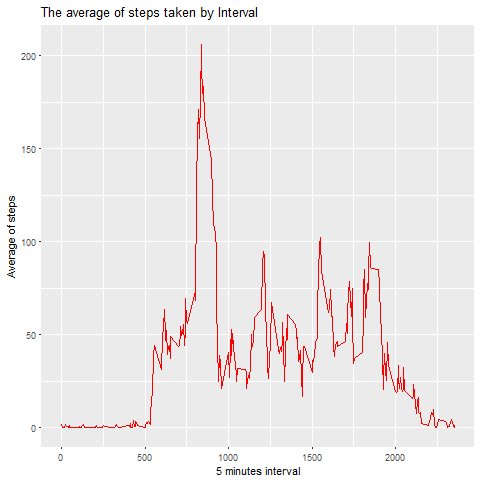

Here i install ggplot2 and dplyr pakages

```r
library(ggplot2)
library(dplyr)
```

```
## 
## Attaching package: 'dplyr'
```

```
## The following objects are masked from 'package:stats':
## 
##     filter, lag
```

```
## The following objects are masked from 'package:base':
## 
##     intersect, setdiff, setequal, union
```

reading the dataset

```r
Activity<- read.csv("activity.csv")
```

```r
head(Activity)
```

```
##   steps       date interval
## 1    NA 2012-10-01        0
## 2    NA 2012-10-01        5
## 3    NA 2012-10-01       10
## 4    NA 2012-10-01       15
## 5    NA 2012-10-01       20
## 6    NA 2012-10-01       25
```
here's a summary of the dataset

```r
summary(Activity)
```

```
##      steps                date          interval     
##  Min.   :  0.00   2012-10-01:  288   Min.   :   0.0  
##  1st Qu.:  0.00   2012-10-02:  288   1st Qu.: 588.8  
##  Median :  0.00   2012-10-03:  288   Median :1177.5  
##  Mean   : 37.38   2012-10-04:  288   Mean   :1177.5  
##  3rd Qu.: 12.00   2012-10-05:  288   3rd Qu.:1766.2  
##  Max.   :806.00   2012-10-06:  288   Max.   :2355.0  
##  NA's   :2304     (Other)   :15840
```

```r
str(Activity)
```

```
## 'data.frame':	17568 obs. of  3 variables:
##  $ steps   : int  NA NA NA NA NA NA NA NA NA NA ...
##  $ date    : Factor w/ 61 levels "2012-10-01","2012-10-02",..: 1 1 1 1 1 1 1 1 1 1 ...
##  $ interval: int  0 5 10 15 20 25 30 35 40 45 ...
```
here i convert date column to date format

```r
Activity$date<- as.Date(as.character(  x = Activity$date , "%Y/%M/%d"))
```

next i will make histagaram shows the number of steps each day i will first groupe the data by day

```r
sumsteps<- Activity %>%
  group_by(day = date)%>%
  summarise(steps= sum(steps))
head(sumsteps)
```

```
## # A tibble: 6 x 2
##          day steps
##       <date> <int>
## 1 2012-10-01    NA
## 2 2012-10-02   126
## 3 2012-10-03 11352
## 4 2012-10-04 12116
## 5 2012-10-05 13294
## 6 2012-10-06 15420
```

This is the histagram of the total number of steps each day


```r
ggplot(data = sumsteps, aes(steps))+geom_histogram(binwidth = 1800,aes(fill= ..count..))+ 
  ggtitle("Totla number of steps taken each day")
```

```
## Warning: Removed 8 rows containing non-finite values (stat_bin).
```


This is the Mean and median number of steps taken each day.

```r
mean(sumsteps$steps,na.rm = TRUE)
```

```
## [1] 10766.19
```

```r
median(sumsteps$steps,na.rm = T)
```

```
## [1] 10765
```

Her's The Time series plot of the average number of steps taken

By day

```r
meanS<- Activity %>%
  filter(!(is.na(steps))) %>%
  group_by(Days = date)%>%
  summarise(meanSteps= mean(steps))
ggplot(data = meanS, aes(x=Days,y=meanSteps))+geom_line(col="blue")+ggtitle("The average of steps taken by day")
```


By 5 minute interval

```r
meanS<- Activity %>%
  filter(!(is.na(steps))) %>%
  group_by(Inv = interval)%>%
  summarise(meanSteps= mean(steps)) 
ggplot(data = meanS, aes(x=Inv,y=meanSteps))+geom_line(col="red")+
  ggtitle("The average of steps taken by Interval")+
  xlab("5 minutes interval")+
  ylab("Average of steps")
```



This is the  5-minute interval that, on average, contains the maximum number of steps

```r
aveInterval<- Activity %>%
  group_by(interval)%>%
  summarise(aveIn=mean(steps,na.rm=T))
aveInterval$interval[aveInterval$aveIn== max(aveInterval$aveIn,na.rm = T)]
```

```
## [1] 835
```

Code to describe and show a strategy for imputing missing data
first we need to se the percentage of the missing data in our dataset.

```r
sum(is.na(Activity$steps))/length(Activity$steps)
```

```
## [1] 0.1311475
```
so  we have 13% missig data in our dataset
Now i will  calclute the the average of steps taken by 5 minutes interval and i will assign the result to the missig values who have the same interval. 

```r
for( index in 1:length(Activity$steps) ){
   if (is.na(Activity$steps[index])){
     x<- aveInterval$aveIn[aveInterval$interval==Activity$interval[index]]
     Activity$steps[index]<- x
     
   }
}
```

now we have 0% missig values.

```r
sum(is.na(Activity$steps))/length(Activity$steps)
```

```
## [1] 0
```

Histogram of the total number of steps taken each day after missing values are imputed


```r
sumsteps<- Activity %>%
  group_by(day = date)%>%
  summarise(steps= sum(steps))
head(sumsteps)
```

```
## # A tibble: 6 x 2
##          day    steps
##       <date>    <dbl>
## 1 2012-10-01 10766.19
## 2 2012-10-02   126.00
## 3 2012-10-03 11352.00
## 4 2012-10-04 12116.00
## 5 2012-10-05 13294.00
## 6 2012-10-06 15420.00
```


```r
ggplot(data = sumsteps, aes(steps))+geom_histogram(binwidth = 1800,aes(fill= ..count..))+ 
  ggtitle("Totla number of steps taken each day after missing value are imputed")
```


Panel plot comparing the average number of steps taken per 5-minute interval across weekdays and weekends
first i will subset only weekends data


```r
unique(weekdays(Activity$date))
```

```
## [1] "Monday"    "Tuesday"   "Wednesday" "Thursday"  "Friday"    "Saturday" 
## [7] "Sunday"
```

```r
weekend<- Activity [weekdays(Activity$date) %in% c("Saturday","Sunday"),]
```
here's the weekends day i subset from the data.

```r
weekdays(unique(weekend$date))
```

```
##  [1] "Saturday" "Sunday"   "Saturday" "Sunday"   "Saturday" "Sunday"  
##  [7] "Saturday" "Sunday"   "Saturday" "Sunday"   "Saturday" "Sunday"  
## [13] "Saturday" "Sunday"   "Saturday" "Sunday"
```
now i will plot the average steps taken by 5 minutes interval in weekends and weekdays

```r
meanSw<- Activity %>%
  group_by(Inv = interval, week=weekdays(Activity$date) %in% c("Saturday","Sunday"))%>%
  summarise(meanSteps= mean(steps)) 
meanSw$week<-as.character( meanSw$week)
meanSw$week[meanSw$week=="TRUE"]<- "weekend"
meanSw$week[meanSw$week=="FALSE"]<- "weekday"
ggplot(data = meanSw, aes(x=Inv,y=meanSteps))+facet_grid(.~week)+  geom_line(col="red")+
  ggtitle("The average of steps taken by Interval weekday VS weeken")+
  xlab("Interval")+
  ylab(" Steps")
```


the plots show that in the weekday most of  steps taken started in the beginning of the day and in weekend the steps taken are almost the same during the day between 25 and 160 steps and continue with same level untel late night.
